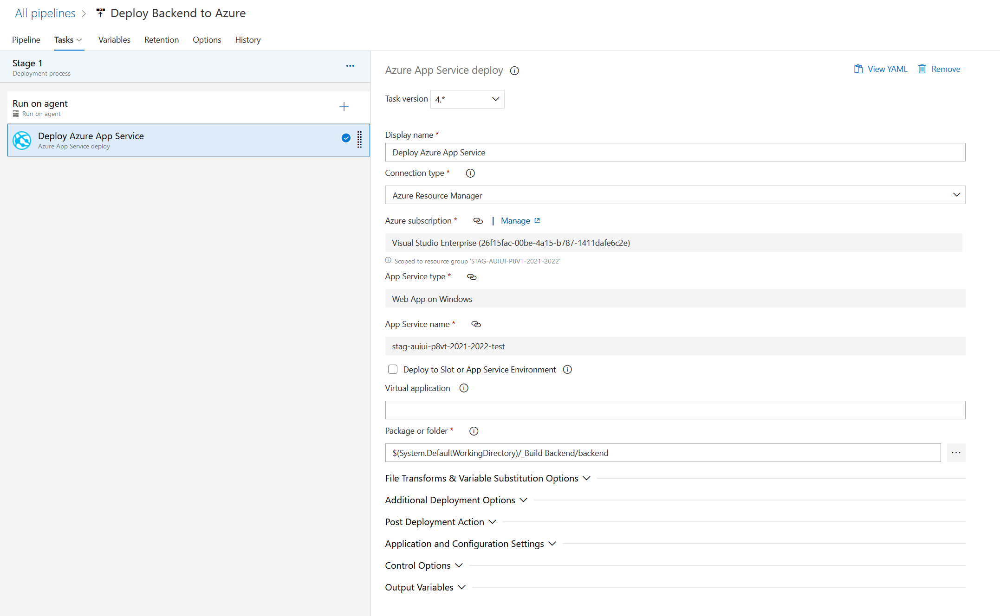

# STAG-AUIUI-AP8VT-2023

_Repository: [https://github.com/Tomas-Juri/STAG-AUIUI-P8VT](https://github.com/Tomas-Juri/STAG-AUIUI-P8VT-2021-2022)_

_Discord channel: [https://discord.gg/9K8PSk4Z7b](https://discord.gg/9K8PSk4Z7b)_

**Table of contents:**

[1. Lekce 10.02.2023](#1-lekce---10022023)  
[2. Lekce 17.02.2023](#2-lekce---17022023)  
[3. Lekce 24.02.2023](#3-lekce---24022023)  
[4. Lekce 03.03.2023](#4-lekce---03032023)  
[5. Lekce 09.03.2023](#5-lekce---10032023)  
[6. Lekce 16.03.2023](#6-lekce---17032023)  
[7. Lekce 23.03.2023](#7-lekce---24032023)  
[8. Lekce 30.03.2023](#8-lekce---31032023)  
[9. Lekce 06.04.2023](#9-lekce---07042023)  
[10. Lekce 13.04.2023](#10-lekce---13042023)  
[11. Lekce 20.04.2023](#11-lekce---20042023)  
[12. Lekce 27.04.2023](#12-lekce---27042023)

## 1. Lekce - 10.02.2023

Overview:

- Initial presentation
- Download presentation
- Setup your own development environment

### Presentation:

[](https://slides.com/jiriurban-1/deck/fullscreen)

### Technical Prerequisites:

- [.NET 7 SDK](https://dotnet.microsoft.com/en-us/download/dotnet/7.0)
- Your favorite IDE
  - [VS Code](https://code.visualstudio.com/)
  - [Visual studio community](https://visualstudio.microsoft.com/cs/vs/community/)
  - [Jetbrains Rider](https://www.jetbrains.com/rider/)
- REST API Client
  - [Insomnia](https://insomnia.rest/)
  - [Postman](https://www.postman.com/)
- [Node JS](https://nodejs.org/en/) (If you want react)

### Create Project and run it

1. Create a Blazor webassembly App - ASP.NET Core Hosted  
   `dotnet new blazorwasm --hosted -n OnlyShare -o .`

2. Or create a React App - ASP.NET Core Hosted  
   `dotnet new react -n OnlyShare -o .`

3. Maybe you will need to install dev certificates  
   `dotnet dev-certs https `

4. Run application using  
   (Blazor) `dotnet run --project .\Server\OnlyShare.Server.csproj`  
   (React) `dotnet run`

5. Or use your ide to run Server project

6. This will run both backend and frontend as one application

   - The ASP.NET server as a host to both API and frontend

7. Delete/Change scaffolded code from project
   - `./Server/Pages` - Remove whole folder
   - `./Server.Program.cs`
     - `builder.Services.AddControllersWithViews();` -> `builder.Services.AddControllers();`
     - `builder.Services.AddRazorPages();` - Remove
     - `app.MapRazorPages();` - Remove

### How to debug (in VS Community)

1. Open the solution in VS community

2. Press the debug button 'https' in VS


More info

- [ASP.NET](https://dotnet.microsoft.com/en-us/apps/aspnet)
- [ASP.NET with React](https://learn.microsoft.com/cs-cz/aspnet/core/client-side/spa/react?view=aspnetcore-7.0&tabs=visual-studio)
- [Blazor web assembly](https://learn.microsoft.com/cs-cz/aspnet/core/client-side/spa/react?view=aspnetcore-7.0&tabs=visual-studio)
- [How to debug blazor](https://learn.microsoft.com/en-us/aspnet/core/blazor/debug)

_Final code commit of this lecture: 28ab2091744fec2e21b396e4beee56e34e815d8a_

---

## 2. Lekce - 17.02.2023

We will create a CI/CD pipeline to deploy our application to a staging server.

Overview:

- Git flow & best practices presentation
- Create a continuous integration pipeline to build your application.
- Create a continous delivery pipeline (release) to deploy your application to server.
- Setup git policies for branches.

### Presentation:

[](https://slides.com/trckatomas/vtv-1stlesson/fullscreen)

Prerequisites:

- Pushed changes into a repository in azure devops

### Create a build definition using YAML

We will create a build definition for the application.

**Create build pipeline (Aspnet + BlazorWasm)**:

```yaml
trigger:
  branches:
    include:
      - master

pool:
  vmImage: windows-latest

variables:
  buildConfiguration: "Release"

steps:
  - task: UseDotNet@2
    displayName: Use Dotnet 7
    inputs:
      version: "7.0.x"

  - task: NuGetToolInstaller@0
    displayName: "Install NuGet"
    inputs:
      versionSpec: 6.0.x
      checkLatest: true

  - task: DotNetCoreCLI@2
    displayName: "Dotnet restore"
    inputs:
      command: restore
      projects: "**/*.csproj"

  - script: dotnet publish Server/OnlyShare.Server.csproj -o $(Build.ArtifactStagingDirectory) --configuration Release /p:EnvironmentName=Development
    displayName: "Dotnet publish OnlyShare"

  - task: PublishBuildArtifacts@1
    inputs:
      PathtoPublish: "$(Build.ArtifactStagingDirectory)"
      ArtifactName: "drop"
```

**Create build pipeline (Aspnet + React)**:

```yaml
trigger:
  branches:
    include:
      - master

pool:
  vmImage: windows-latest

variables:
  buildConfiguration: "Release"

steps:
  - task: UseDotNet@2
    displayName: Use Dotnet 7
    inputs:
      version: "7.0.x"

  - task: NuGetToolInstaller@0
    displayName: "Install NuGet"
    inputs:
      versionSpec: 6.0.x
      checkLatest: true

  - task: DotNetCoreCLI@2
    displayName: "Dotnet restore"
    inputs:
      command: restore
      projects: "**/*.csproj"

  - script: dotnet publish OnlyShare.csproj -o $(Build.ArtifactStagingDirectory) --configuration Release /p:EnvironmentName=Development
    displayName: "Dotnet publish OnlyShare"

  - task: PublishBuildArtifacts@1
    inputs:
      PathtoPublish: "$(Build.ArtifactStagingDirectory)"
      ArtifactName: "drop"
```

### Create a release pipeline in Azure DevOps

To host our applications, we will use Azure app service.  
To deploy our application, we will create a release pipeline.

Release pipeline:
1. Create new Release pipeline
2. Select 'Azure App Service deployment'
3. Add artifact
4. Configure Azure App Service deployment
   - Add subscription (admin needed)
   - Add application (admin needed)
   - Select Package/Folder location (from build)




If we did everything correctly, we should have our application deployed and it should look like this:

- [Azure/OnlyShare](https://cngroup-utb--2023-os-internaltest.azurewebsites.net/)

More Info:

- [Azure pipelines](https://learn.microsoft.com/en-us/azure/devops/pipelines/create-first-pipeline?view=azure-devops&tabs=net%2Ctfs-2018-2%2Cbrowser)

### Application urls of teams

- Amundsen: https://cngroup-utb--2023-os-amundsen.azurewebsites.net
- Hd kvalita: https://cngroup-utb--2023-os-hd-kvalita.azurewebsites.net
- Nevime: https://cngroup-utb--2023-os-nevime.azurewebsites.net
- ORZ: https://cngroup-utb--2023-os-orz.azurewebsites.net
- Sempa: https://cngroup-utb--2023-os-sempa.azurewebsites.net
- ToPujde: https://cngroup-utb--2023-os-topujde.azurewebsites.net

How can i get my release running automagically after a new build ?

More info:

- [YAML](https://yaml.org/)
- [Azure devops pipelines](https://docs.microsoft.com/cs-cz/azure/devops/pipelines/?view=azure-devops)
- [Continuous Integration](https://en.wikipedia.org/wiki/Continuous_integration)
- [Continuous Deployment](https://en.wikipedia.org/wiki/Continuous_deployment)

_Final code commit of this lecture: TODO_

## 3. Lekce - 24.02.2023

> TODO

## 4. Lekce - 03.03.2023

> TODO

## 5. Lekce - 10.03.2023

> TODO

## 6. Lekce - 17.03.2023

> TODO

## 7. Lekce - 24.03.2023

> TODO

## 8. Lekce - 31.03.2023

> TODO

## 9. Lekce - 07.04.2023

> TODO

## 10. Lekce - 13.04.2023

> TODO

## 11. Lekce - 20.04.2023

> TODO

## 12. Lekce - 27.04.2023

> TODO
