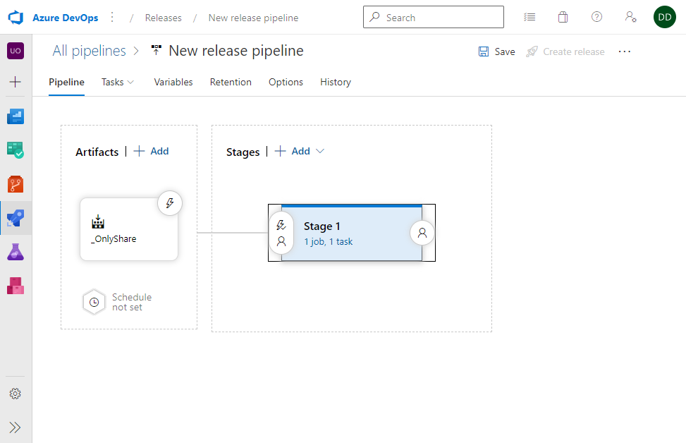
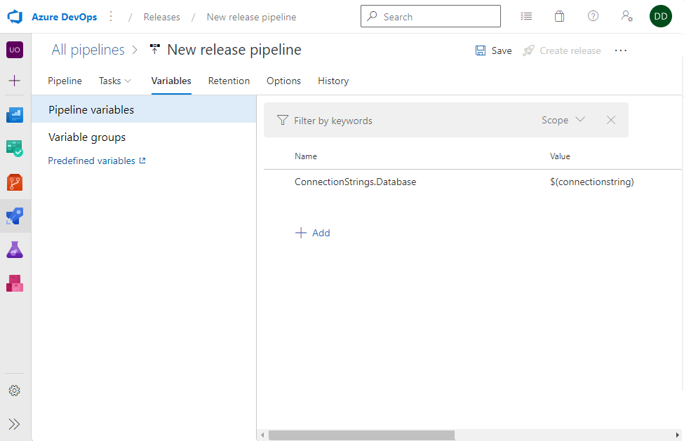
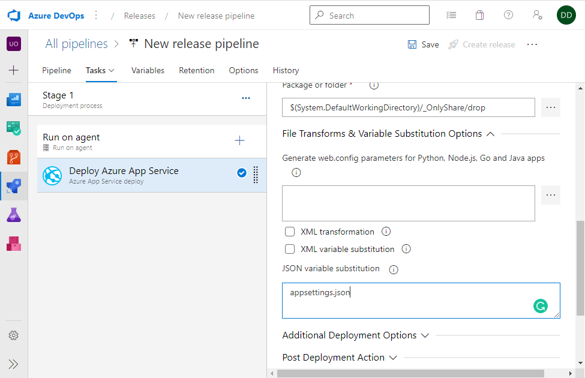

# STAG-AUIUI-P8VT 2023
{: .no_toc }

## Table of contents
{: .no_toc .text-delta }

1. TOC
{:toc}

---

## 1. Lekce - 10.02.2023

Overview:

- Initial presentation
- Download presentation
- Setup your own development environment

### Presentation:

[](https://slides.com/jiriurban-1/deck/fullscreen)

### Technical Prerequisites:

- [.NET 7 SDK](https://dotnet.microsoft.com/en-us/download/dotnet/7.0)
- Your favorite IDE
  - [VS Code](https://code.visualstudio.com/)
  - [Visual studio community](https://visualstudio.microsoft.com/cs/vs/community/)
  - [Jetbrains Rider](https://www.jetbrains.com/rider/)
- REST API Client
  - [Insomnia](https://insomnia.rest/)
  - [Postman](https://www.postman.com/)
- [Node JS](https://nodejs.org/en/) (If you want react)

### Create Project and run it

1. Create a Blazor webassembly App - ASP.NET Core Hosted  
   `dotnet new blazorwasm --hosted -n OnlyShare -o .`

2. Or create a React App - ASP.NET Core Hosted  
   `dotnet new react -n OnlyShare -o .`

3. Maybe you will need to install dev certificates  
   `dotnet dev-certs https `

4. Run application using  
   (Blazor) `dotnet run --project .\Server\OnlyShare.Server.csproj`  
   (React) `dotnet run`

5. Or use your ide to run Server project

6. This will run both backend and frontend as one application

   - The ASP.NET server as a host to both API and frontend

7. Delete/Change scaffolded code from project
   - `./Server/Pages` - Remove whole folder
   - `./Server.Program.cs`
     - `builder.Services.AddControllersWithViews();` -> `builder.Services.AddControllers();`
     - `builder.Services.AddRazorPages();` - Remove
     - `app.MapRazorPages();` - Remove

### How to debug (in VS Community)

1. Open the solution in VS community

2. Press the debug button 'https' in VS


More info

- [ASP.NET](https://dotnet.microsoft.com/en-us/apps/aspnet)
- [ASP.NET with React](https://learn.microsoft.com/cs-cz/aspnet/core/client-side/spa/react?view=aspnetcore-7.0&tabs=visual-studio)
- [Blazor web assembly](https://learn.microsoft.com/cs-cz/aspnet/core/client-side/spa/react?view=aspnetcore-7.0&tabs=visual-studio)
- [How to debug blazor](https://learn.microsoft.com/en-us/aspnet/core/blazor/debug)

_Final code commit of this lecture: 28ab2091744fec2e21b396e4beee56e34e815d8a_

---

## 2. Lekce - 17.02.2023

We will create a CI/CD pipeline to deploy our application to a staging server.

Overview:

- Git flow & best practices presentation
- Create a continuous integration pipeline to build your application.
- Create a continous delivery pipeline (release) to deploy your application to server.
- Setup git policies for branches.

### Presentation:

[](https://slides.com/trckatomas/vtv-1stlesson/fullscreen)

Prerequisites:

- Pushed changes into a repository in azure devops

### Create a build definition using YAML

We will create a build definition for the application.

**Create build pipeline (Aspnet + BlazorWasm)**:

```yaml
trigger:
  branches:
    include:
      - master

pool:
  vmImage: windows-latest

variables:
  buildConfiguration: "Release"

steps:
  - task: UseDotNet@2
    displayName: Use Dotnet 7
    inputs:
      version: "7.0.x"

  - task: NuGetToolInstaller@0
    displayName: "Install NuGet"
    inputs:
      versionSpec: 6.0.x
      checkLatest: true

  - task: DotNetCoreCLI@2
    displayName: "Dotnet restore"
    inputs:
      command: restore
      projects: "**/*.csproj"

  - script: dotnet publish Server/OnlyShare.Server.csproj -o $(Build.ArtifactStagingDirectory) --configuration Release /p:EnvironmentName=Development
    displayName: "Dotnet publish OnlyShare"

  - task: PublishBuildArtifacts@1
    inputs:
      PathtoPublish: "$(Build.ArtifactStagingDirectory)"
      ArtifactName: "drop"
```

**Create build pipeline (Aspnet + React)**:

```yaml
trigger:
  branches:
    include:
      - master

pool:
  vmImage: windows-latest

variables:
  buildConfiguration: "Release"

steps:
  - task: UseDotNet@2
    displayName: Use Dotnet 7
    inputs:
      version: "7.0.x"

  - task: NuGetToolInstaller@0
    displayName: "Install NuGet"
    inputs:
      versionSpec: 6.0.x
      checkLatest: true

  - task: DotNetCoreCLI@2
    displayName: "Dotnet restore"
    inputs:
      command: restore
      projects: "**/*.csproj"

  - script: dotnet publish OnlyShare.csproj -o $(Build.ArtifactStagingDirectory) --configuration Release /p:EnvironmentName=Development
    displayName: "Dotnet publish OnlyShare"

  - task: PublishBuildArtifacts@1
    inputs:
      PathtoPublish: "$(Build.ArtifactStagingDirectory)"
      ArtifactName: "drop"
```

### Create a release pipeline in Azure DevOps

To host our applications, we will use Azure app service.  
To deploy our application, we will create a release pipeline.

Release pipeline:

1. Create new Release pipeline
2. Select 'Azure App Service deployment'
3. Add artifact
4. Configure Azure App Service deployment
   - Add subscription (admin needed)
   - Add application (admin needed)
   - Select Package/Folder location (from build)


If we did everything correctly, we should have our application deployed and it should look like this:

- [Azure/OnlyShare](https://cngroup-utb--2023-os-internaltest.azurewebsites.net/)

More Info:

- [Azure pipelines](https://learn.microsoft.com/en-us/azure/devops/pipelines/create-first-pipeline?view=azure-devops&tabs=net%2Ctfs-2018-2%2Cbrowser)

### Application urls of teams

- Amundsen: https://cngroup-utb--2023-os-amundsen.azurewebsites.net
- Hd kvalita: https://cngroup-utb--2023-os-hd-kvalita.azurewebsites.net
- Nevime: https://cngroup-utb--2023-os-nevime.azurewebsites.net
- ORZ: https://cngroup-utb--2023-os-orz.azurewebsites.net
- Sempa: https://cngroup-utb--2023-os-sempa.azurewebsites.net
- ToPujde: https://cngroup-utb--2023-os-topujde.azurewebsites.net

How can i get my release running automagically after a new build ?

More info:

- [YAML](https://yaml.org/)
- [Azure devops pipelines](https://docs.microsoft.com/cs-cz/azure/devops/pipelines/?view=azure-devops)
- [Continuous Integration](https://en.wikipedia.org/wiki/Continuous_integration)
- [Continuous Deployment](https://en.wikipedia.org/wiki/Continuous_deployment)

_Final code commit of this lecture: c8c15d90eb5b5d41ec037f5fb8e9ce4f695a1519_

## 3. Lekce - 24.02.2023

We will create a CI/CD pipeline to deploy our application to a staging server.
We will create and connect to local and azure databases.

Overview:

- ORM & Entity Framework
- Create migrations and local database
- Seed database with default data
- Add connection to Azure database to Release pipeline via connection string stored in Azure Keyvault

### Presentation:

[](https://slides.com/daviddlugosz/vtv-3rdlesson-orm-entity-framework/fullscreen)

### Prerequisites:

- Working CI pipeline (build)
- Working Release pipeline (deploy) [I can see my applications deployed on Azure]
- Microsoft SQL Server - [Download here](https://www.microsoft.com/cs-cz/sql-server/sql-server-downloads) Developer version
- Microsoft SQL Server management studio - [Download here](https://docs.microsoft.com/en-us/sql/ssms/download-sql-server-management-studio-ssms?view=sql-server-ver15)

### Release pipeline triggers

[Release triggers in azure devops](https://docs.microsoft.com/en-us/azure/devops/pipelines/release/triggers?view=azure-devops)

### Connect to a MSSQL database

You should have MSSQL running, and now you have to create a database for local development.

Install these packages to Server project:

- `Microsoft.EntityFrameworkCore`
- `Microsoft.EntityFrameworkCore.Design`
- `Microsoft.EntityFrameworkCore.SqlServer`
- `Microsoft.EntityFrameworkCore.Tools`

Add DB Context

```csharp
// file: /Database/DataContext.cs

public class DataContext : DbContext
{
    public DataContext(DbContextOptions<DataContext> options) : base(options)
    {

    }
}
```

Add DB Models - notice the Id property

```csharp
// file: /Database/Models/WeatherForecast.cs

public class WeatherForecast
{
    public Guid Id { get; set; }

    public DateTime Date { get; set; }

    public int TemperatureC { get; set; }

    public string Summary { get; set; } = string.Empty;
}
```

Use Model in DBContext

```csharp
// file: /Database/DataContext.cs

public class DataContext : DbContext
{
    public DataContext(DbContextOptions<DataContext> options) : base(options)
    {

    }

    public DbSet<Models.WeatherForecast> WeatherForecasts { get; set; } = default!;
}
```

Set database connection string to database on local SQL Server

- Add to appsettings.json

```json
...
"ConnectionStrings": {
  "Database": "Data Source={name of your local server};Initial Catalog={name of your database};Trusted_Connection=True;Encrypt=False"
}
...
```

Add DataContext to DI container (startup)

```csharp
// file: /Program.cs

...

builder.Services.AddDbContext<DataContext>(options =>
    options.UseSqlServer(builder.Configuration.GetConnectionString("Database")));

...
```

Add migrations to project

- Open Package Manager Console
- `Add-Migration InitialMigration`

Apply migrations on application start (Automagically)

```csharp
// file: /Program.cs

...

using var scope = app.Services.CreateScope();
var dataContext = scope.ServiceProvider.GetRequiredService<DataContext>();

if (dataContext == null)
    throw new NullReferenceException("DataContext is not initialized in DI in Program.cs");

dataContext.Database.Migrate();
...
```

Add Repository and map onto existing WeatherForecast class
NOTE: Return type is shared WeatherForecast class, not database model one

```csharp
// file: /Database/Repositories/IWeatherForecastRepository.cs

public interface IWeatherForecastRepository
{
    IEnumerable<WeatherForecast> GetWeatherForecasts();
}

// file: /Database/Repositories/WeatherForecastRepository.cs

public class WeatherForecastRepository : IWeatherForecastRepository
{
    private readonly DataContext _context;

    public WeatherForecastRepository(DataContext context)
    {
        _context = context;
    }

    public IEnumerable<WeatherForecast> GetWeatherForecasts()
    {
        return _context.WeatherForecasts
            .Select(wf => new WeatherForecast
            {
                Date = DateOnly.FromDateTime(wf.Date),
                Summary = wf.Summary,
                TemperatureC = wf.TemperatureC
            });
    }
}
```

Add Repository to DI container (startup)

```csharp
// file: /Program.cs

...

builder.Services.AddScoped<IWeatherForecastRepository, WeatherForecastRepository>();

...
```

Use Repository in controller to show data from db

```csharp
// file: /Controllers/WeatherForecastController.cs

[ApiController]
[Route("[controller]")]
public class WeatherForecastController : ControllerBase
{
    private readonly IWeatherForecastRepository _repository;

    public WeatherForecastController(IWeatherForecastRepository repository)
    {
        _repository = repository;
    }

    [HttpGet(Name = "GetWeatherForecast")]
    public IEnumerable<WeatherForecast> Get()
    {
        return _repository.GetWeatherForecasts();
    }
}

```

Run the app and test your API

No Data? Let's seed some default data

```csharp
// file: /Database/DataContext.cs

...
protected override void OnModelCreating(ModelBuilder modelBuilder)
{
    base.OnModelCreating(modelBuilder);

    modelBuilder.Entity<Models.WeatherForecast>().HasData(new Models.WeatherForecast
    {
        Id = Guid.NewGuid(),
        Date = DateTime.Now.AddYears(-2),
        Summary = "Weather 1",
        TemperatureC = 30,
    });
    modelBuilder.Entity<Models.WeatherForecast>().HasData(new Models.WeatherForecast
    {
        Id = Guid.NewGuid(),
        Date = DateTime.Now.AddYears(-1),
        Summary = "Weather 2",
        TemperatureC = 35,
    });
    modelBuilder.Entity<Models.WeatherForecast>().HasData(new Models.WeatherForecast
    {
        Id = Guid.NewGuid(),
        Date = DateTime.Now,
        Summary = "Weather 3",
        TemperatureC = 40,
    });
}
...
```

Add new migration to project

- Open Package Manager Console
- `Add-Migration SeedData`

Run app again and verify you see the data we just seed into database

Let's add connectionString saved in Azure keyvault to your Release pipeline

### Keyvault names of teams

- Amundsen: ...
- Hd kvalita: ...
- Nevime: ...
- ORZ: ...
- Sempa: ...
- ToPujde: ...








Create CRUD endpoints to manage data ?

More info:

- [Entity Framework](https://docs.microsoft.com/en-us/ef/)
- [EF Migrations](https://docs.microsoft.com/en-us/ef/core/managing-schemas/migrations/?tabs=dotnet-core-cli)

_Final code commit of this lecture: c8c15d90eb5b5d41ec037f5fb8e9ce4f695a1519_

## 4. Lekce - 03.03.2023

UX/UI Presentation

### Prerequisites:

- Working backend database connection using Entity framework
- Knowing how to use DBContext to CRUD data
- Installed Postman (or alternative for testing APIs)

### Postman

First, test your GET WeatherForecast EP with Postman.

### Swagger

Let's add Swagger to the app so we can easily see what EPs our BE offers

You will need `Swashbuckle.AspNetCore` package.

```csharp
// file: Program.cs

...
// Learn more about configuring Swagger/OpenAPI at https://aka.ms/aspnetcore/swashbuckle
builder.Services.AddEndpointsApiExplorer();
builder.Services.AddSwaggerGen();

...

if (app.Environment.IsDevelopment())
{
    app.UseWebAssemblyDebugging();

    app.UseSwagger();
    app.UseSwaggerUI();
}
...
```

### JWT Authentication & Authorization

Create a new request/response classes for registration/login

```csharp
// file: Contracts/LoginRequest

public class LoginRequest
{
    public string Email { get; set; } = string.Empty;

    public string Password { get; set; } = string.Empty;
}
```

```csharp
// file: Contracts/LoginResponse.cs

public class LoginResponse
{
    public string Token { get; set; } = string.Empty;
}
```

```csharp
// file: Contracts/RegisterRequest.cs

public class RegisterRequest
{
    public string Email { get; set; } = string.Empty;

    public string Password { get; set; } = string.Empty;

    public string PasswordRepeat { get; set; } = string.Empty;

    public string Username { get; set; } = string.Empty;
}
```

```csharp
// file: Contracts/RegisterResponse.cs

public class RegisterResponse
{

}
```

Create new Account Controller

```csharp
// file: Controllers/AccountController.cs

[ApiController]
[Route("[controller]")]
public class AccountController : ControllerBase
{
    private readonly DataContext _dataContext;

    public AccountController(DataContext dataContext)
    {
        _dataContext = dataContext;
    }

    [HttpPost("[action]")]
    public IActionResult Register(RegisterRequest request)
    {
       ...
    }

    [HttpPost("[action]")]
    public IActionResult Login(LoginRequest request)
    {
        ...
    }
}
```

Implement Register Method

```csharp
// file: Controllers/AccountController.cs

[HttpPost("[action]")]
public IActionResult Register(RegisterRequest request)
{
    if (request.Password != request.PasswordRepeat)
        return BadRequest("Zadaná hesla se neshodují");

    if (_dataContext.Users.Any(user => user.Email == request.Email))
        return BadRequest($"Uživatel s emailem {request.Email} je již registrován");

    var (passwordSalt, passwordHash) = CreatePasswordHash(request.Password);

    var user = new User
    {
        Email = request.Email,
        Username = request.Username,
        PasswordHash = passwordHash,
        PasswordSalt = passwordSalt
    };

    _dataContext.Add(user);
    _dataContext.SaveChanges();

    // send email here

    return Ok("Uživatel vytvořen");
}

private static (byte[] passwordSalt, byte[] passwordHash) CreatePasswordHash(string password)
{
    using var hmac = new System.Security.Cryptography.HMACSHA512();
    var passwordSalt = hmac.Key;
    var passwordHash = hmac.ComputeHash(Encoding.UTF8.GetBytes(password));
    return (passwordSalt, passwordHash);
}
```

Create user Table/Entity

```csharp
// file: Database/Models/User.cs

public class User
{
    public Guid Id { get; set; }

    public string Email { get; set; } = string.Empty;

    public string Username { get; set; } = string.Empty;

    public byte[] PasswordHash { get; set; } = Array.Empty<byte>();

    public byte[] PasswordSalt { get; set; } = Array.Empty<byte>();
}
```

And add it to dbContext

```csharp
// file: Database/DataContext.cs

public DbSet<User> Users { get; set; } = default!;
```

Create migration and run the app to apply it.
You can now test if your register Endpoint works - if your request passess validations, there should be a new user in the DB.

Generate your JwtSecret and put it into appsettings.json (we will use HmacSha256 encryption algorithm, so the secret should be 32 bytes long)

```json
...
"AppSettings": {
  "JwtSecret": "{your secret}"
}
...
```

Create a class mapping the AppSettings part of appsettings.json

```csharp
// file: AppSettings.cs

public class AppSettings
{
    public string JwtSecret { get; set; } = String.Empty;
}
```

Inject AppSettings into AccountController

```csharp
// file: Controllers/AccountController.cs
...
private readonly IOptions<AppSettings> _options;

public AccountController(DataContext dataContext, IOptions<AppSettings> options)
{
    _dataContext = dataContext;
    _options = options;
}
...
```

Implement Login Method  
You may need to add several usings into the file

```csharp
// file: Controllers/AccountController.cs

[HttpPost("[action]")]
public IActionResult Login(LoginRequest request)
{
    var user = _dataContext.Users.FirstOrDefault(user => request.Email == user.Email);

    if (user == null)
        return NotFound($"Uživatel ${request.Email} nenalezen.");

    if (VerifyPasswordHash(request.Password, user.PasswordHash, user.PasswordSalt) == false)
        return BadRequest("Neplatné přihlášení");


    var tokenHandler = new JwtSecurityTokenHandler();
    var key = Encoding.ASCII.GetBytes(_options.Value.JwtSecret);
    var tokenDescriptor = new SecurityTokenDescriptor
    {
        Subject = new ClaimsIdentity(new[]
        {
            new Claim("id", user.Id.ToString()),
            new Claim(ClaimTypes.Name, user.Email)
        }),
        Expires = DateTime.UtcNow.AddDays(7),
        SigningCredentials = new SigningCredentials(new SymmetricSecurityKey(key), SecurityAlgorithms.HmacSha256Signature)
    };
    var token = tokenHandler.CreateToken(tokenDescriptor);
    var tokenString = tokenHandler.WriteToken(token);

    if (tokenString == null)
        return BadRequest("Nepodařilo se přihlásit");

    return Ok(new LoginResponse { Token = tokenString });
}

private static bool VerifyPasswordHash(string password, byte[] storedHash, byte[] storedSalt)
{
    if (storedHash.Length != 64)
        throw new ArgumentException("Invalid length of password hash (64 bytes expected).", nameof(storedHash));
    if (storedSalt.Length != 128)
        throw new ArgumentException("Invalid length of password salt (128 bytes expected).", nameof(storedSalt));

    using var hmac = new System.Security.Cryptography.HMACSHA512(storedSalt);
    var computedHash = hmac.ComputeHash(Encoding.UTF8.GetBytes(password));
    for (var i = 0; i < computedHash.Length; i++)
    {
        if (computedHash[i] != storedHash[i]) return false;
    }

    return true;
}
```

Now you can test that you can log as a registered user and you will get your JWT token, which you can inspect at [https://jwt.io](https://jwt.io).  
This token will be used by frontend to prove its identity.

Plug in the ASP.NET authorization for JWT tokens.  
You will need `Microsoft.AspNetCore.Authentication.JwtBearer` package.

```csharp
// file: Program.cs

var appSettingsSection = builder.Configuration.GetSection("AppSettings");
var jwtSecret = appSettingsSection.Get<AppSettings>().JwtSecret;
builder.Services.Configure<AppSettings>(appSettingsSection);

...

builder.Services.AddAuthentication(options =>
    {
        options.DefaultAuthenticateScheme = JwtBearerDefaults.AuthenticationScheme;
        options.DefaultChallengeScheme = JwtBearerDefaults.AuthenticationScheme;
    })
    .AddJwtBearer(options =>
    {
        options.Events = new JwtBearerEvents
        {
            OnTokenValidated = context =>
            {
                var dataContext = context.HttpContext.RequestServices.GetRequiredService<DataContext>();
                var userId = context.Principal.Identity.Name;
                var user = dataContext.Users.FirstOrDefault(user => user.Email == userId);

                if (user == null)
                    context.Fail("Unauthorized");

                return Task.CompletedTask;
            }
        };
        options.RequireHttpsMetadata = false;
        options.SaveToken = true;
        options.TokenValidationParameters = new TokenValidationParameters
        {
            ValidateIssuerSigningKey = true,
            IssuerSigningKey = new SymmetricSecurityKey(Encoding.ASCII.GetBytes(jwtSecret)),
            ValidateIssuer = false,
            ValidateAudience = false
        };
    });

...

app.UseAuthentication();

```

Now your app is configured to authenticate using JWT tokens. But you cannot really test this, can you ?

We can add `[Authorize]` attribute to our controller methods to prevent unauthorized users to use them

```csharp
// file: Controllers/WeatherForecastController.cs

[HttpPost]
[Authorize]
public void Create(WeatherForecast weatherForecast)
{

```

Now we can test that only if we send the token in Authorize-Headers we are able to create a weatherforecast, using this endpoint.

How to use token in swagger ?
How to store the token in frontend ?

### More Info:

- [jwt.io](https://jwt.io/)
- [Overview of ASP.NET Core authentication](https://docs.microsoft.com/en-us/aspnet/core/security/authentication/?view=aspnetcore-6.0)

_Final code commit of this lecture: c8c15d90eb5b5d41ec037f5fb8e9ce4f695a1519_

---

## 5. Lekce - 10.03.2023


### Prerequisites:

- You can log as a registered user and you will get your JWT token from your backend
- Knowing what jwt token is

## 6. Lekce - 17.03.2023

> TODO

## 7. Lekce - 24.03.2023

> TODO

## 8. Lekce - 31.03.2023

### Presentation:

[](https://slides.com/daviddlugosz/vtv-3rdlesson-databases/fullscreen)

## 9. Lekce - 07.04.2023

> TODO

## 10. Lekce - 13.04.2023

> TODO

## 11. Lekce - 20.04.2023

Lego game

## 12. Lekce - 27.04.2023

> TODO

## 13. Lekce - 05.05.2023

Lecture skipped in favor of coding

## 14. Lekce - 12.05.2023

Final assessment 
