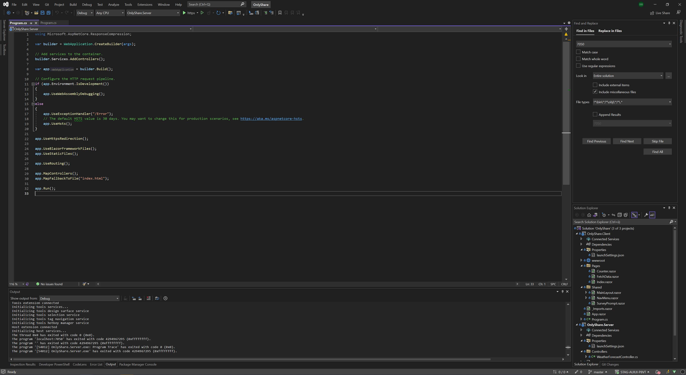

# STAG-AUIUI-P8VT 2024
{: .no_toc }

## Table of contents
{: .no_toc .text-delta }

1. TOC
{:toc}

---

## 1. Lekce - 10.02.2024

### Technical Prerequisites:

- [.NET 8 SDK](https://dotnet.microsoft.com/en-us/download/dotnet/8.0)
- Your favorite IDE
    - [VS Code](https://code.visualstudio.com/)
    - [Visual studio community](https://visualstudio.microsoft.com/cs/vs/community/)
    - [Jetbrains Rider](https://www.jetbrains.com/rider/)
- REST API Client
    - [Insomnia](https://insomnia.rest/)
    - [Postman](https://www.postman.com/)
- [Node JS](https://nodejs.org/en/) for react development
- [MSSQL](https://www.google.com/url?sa=t&rct=j&q=&esrc=s&source=web&cd=&ved=2ahUKEwjUwczW8bmDAxU11gIHHZcPB90QFnoECBIQAQ&url=https%3A%2F%2Fwww.microsoft.com%2Fen-us%2Fsql-server%2Fsql-server-downloads&usg=AOvVaw0d74lgRcnfX6ZThGwL_ED6&opi=89978449) or a [Docker image](https://hub.docker.com/_/microsoft-mssql-server) (mcr.microsoft.com/mssql/server:latest) for local database
- [SQL Management Studio](https://learn.microsoft.com/en-us/sql/ssms/download-sql-server-management-studio-ssms?view=sql-server-ver16) or other tools for managing database
  - [Azure Data Studio](https://azure.microsoft.com/en-us/products/data-studio)

### Copy project a get it working locally

1. Copy the project

2. Build the application via `dotnet new`

3. Run the application via IDE or `dotnet run`

4. Maybe you will need to install dev certificates  
   `dotnet dev-certs https `

5. Application will probably crash due to missing database

6. Create a database in your local SQL server

7. Change your connection string in your `appsettings.json` `ConnectionStrings--Database`

8. Run the application again

9. This will run both backend and frontend as one application
  - The ASP.NET server as a host to both API and frontend

### How to debug (in VS Community)

1. Open the solution in VS community

2. Press the debug button 'https' in VS

More info

- [ASP.NET](https://dotnet.microsoft.com/en-us/apps/aspnet)
- [ASP.NET with React](https://learn.microsoft.com/cs-cz/aspnet/core/client-side/spa/react?view=aspnetcore-7.0&tabs=visual-studio)
- [Blazor web assembly](https://learn.microsoft.com/cs-cz/aspnet/core/client-side/spa/react?view=aspnetcore-7.0&tabs=visual-studio)
- [How to debug blazor](https://learn.microsoft.com/en-us/aspnet/core/blazor/debug)
