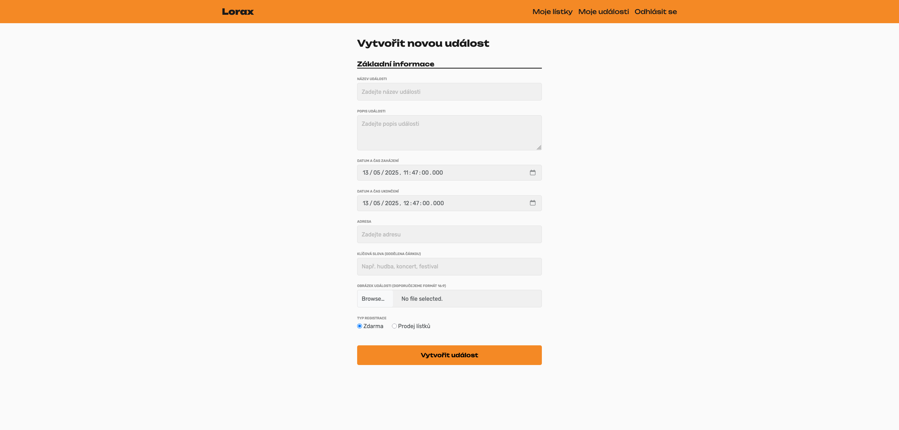

# STAG-AUIUI-P8VT 2025

{: .no_toc }

# Náplň a požadavky

Kurz AP8VT si klade za cíl naučit studenty kvalitně a efektivně vyvíjet aplikace podle moderních přístupů a postupů. Přednášky jsou
realizovány také formou praktických workshopů, v rámci nichž dílčí týmy postupně budují svůj webový produkt. Cvičení se zaměřují na
využívání konkrétních technologií, pomocí kterých studenti průběžně realizují týmový projekt.

## Lektoři

**Petr Záček**
Organizační záležitosti univerzity, garant předmětu, Product Owner

**Jiří Urban**
Hlavní přednášející, organizace kurzu, Product Owner

**Tomáš Juřička**
Hlavní cvičící

**Stanislav Čermák**
Product Owner

## Docházka

Povoleny jsou 3 absence, v opačném případě je třeba donést omluvenku od doktora.

## Způsob hodnocení

Studenti mohou během semestru získat až 70 bodů v následující struktuře:

**Projekt – 65 bodů**

-   Projekt je rozdělen do 5 sprintů, každý po 10 bodech.
-   Finální sprint (ve zkouškovém období) má hodnotu 15 bodů.

**Go to market – 5 bodů**

-   Extra body je možné získat za prokazatelnou snahu uvést aplikaci na "trh".
    -   Získání a zpracování zpětné vazby od reálných uživatelů.
    -   Marketingové aktivity spojené s propagací aplikace
    -   Viditelný engagement uživatelů aplikace

Bodování projektu sestává z hodnocení dílčích sprintů (Scrum terminologie). Konkrétní bodování za jednotlivé sprinty probíhá následovně:

1. Vedení kurzu a product owneri ohodnotí increment každého sprintu hodnotou 0-100 % za plánování a jeho formální správnost, dodané množství
   práce (increment), komunikaci a projev v průběhu sprintu, prezentaci při sprint review.
2. Všechna tři hodnocení se zprůměrují (např. 85 %) a tímto průměrem se násobí maximální možný počet bodů (10 bodů \* počet členů týmu).
   Například pro 5ti-členný tým by součet byl max. 50 bodů, který mohl tým za sprint získat.
3. Body se zaokrouhlí na celé číslo nahoru a tím se získá bodové ohodnocení za tento sprint pro daný tým (např. 43 bodů).
4. Tyto body si mezi sebe rozdělí členové týmu na základě vzájemné dohody, jak kdo v daném sprintu pracoval.
5. Tým je povinen nahlásit do 3 dnů od přidělení bodů po sprint review počet bodů pro jednotlivé členy v týmu (např. Karel 8b, Monika 10 bodů, Pepa 5 bodů,
   Simona 10 bodů, Šimon 10 bodů). Tímto způsobem můžete reflektovat skutečnou práci na projektu napříč týmem. Pokud tým nestihne poslat body včas, body za sprint propadají.

### Zvláštní pravidla

Za jeden sprint může jednotlivec v rámci přerozdělování bodů v týmu dostat i více bodů než 10, maximálně však o 2 body více než je maximum.
Počet přidělených bodů na jednoho zaokrouhlete na celá čísla.
Za finální (poslední) sprint je nutné, aby tým obdržel minimálně 50% bodů pro úspěšné absolvování kurzu. V případě, že se tak nestane, bude
vedoucí kurzu s týmem řešit celou situaci a buď celý tým nebo určití jedinci dostanou z kurzu známku F.

Přepočet bodů na konkrétní známky odpovídá standardům vysokých škol.

<iframe src="https://docs.google.com/spreadsheets/u/1/d/e/2PACX-1vTQ3jHS6tC_j0in8UQweziS8DoeepuyOBnnn6vZ6E-JRoMXzwSNflS9eCaLqte9fAenSl_RgjrRvJru/pubhtml?gid=0&amp;single=true" style="width: 100%;height: 60rem;"></iframe>

## Program výuky

| Lekce     | Datum     | Přednáška                                                                                                                    |
| --------- | --------- | ---------------------------------------------------------------------------------------------------------------------------- |
| 1. Lekce  | 10.2.2025 | Seznámení s předmětem, Představení projektu, Sestavení týmů, Základy Scrumu a Agilniho vývoje, Seznámení s šablonou aplikace |
| 2. Lekce  | 17.2.2025 | Lean Canvas workshop, Continuous development & Continuous integration, Azure                                                 |
| 3. Lekce  | 24.2.2025 | Přednáška - UI a UX / Figma / Backlog                                                                                        |
| 4. Lekce  | 3.3.2025  | Sprint review 1 / Základy scrumu 2, Git, Trunk based development, small releases                                             |
| 5. Lekce  | 10.3.2025 | Scrum game                                                                                                                   |
| 6. Lekce  | 17.3.2025 | Sprint review 2                                                                                                              |
| 7. Lekce  | 24.3.2025 | Přednáška - Filip Kapler                                                                                                     |
| 8. Lekce  | 31.3.2025 | Sprint review 3                                                                                                              |
| 9. Lekce  | 7.4.2025  | Přednáška - Život ve startupu s OpenVibe                                                                                     |
| 10. Lekce | 14.4.2025 | Sprint review 4                                                                                                              |
| 11. Lekce | 21.4.2025 | -- Velikonoce --                                                                                                             |
| 12. Lekce | 28.4.2025 | Sprint review 5                                                                                                              |
| 13. Lekce | 5.5.2025  | Finální retrospektiva / Pokročilý scrum                                                                                      |
| 14. Lekce | 12.5.2025 | Finální prezentace projektu                                                                                                  |

## 1. Lekce

### Seznámení s předmětem, Představení projektu, Sestavení týmů, Základy Scrumu a Agilniho vývoje

Odkaz na
přednášku: [Úvod](https://docs.google.com/presentation/d/1yTSpYGDSLRayM4I8yML0vNC_a2_kXp1l/edit?usp=sharing&ouid=112391049308284909945&rtpof=true&sd=true)

### Seznámení s šablonou aplikace

Prerequisites:

-   [.NET 9 SDK](https://dotnet.microsoft.com/en-us/download/dotnet/9.0)
-   Your favorite IDE ([Rider recommended](https://www.jetbrains.com/rider/))
-   [Docker](https://www.docker.com/)
-   [MSSQL Docker image](https://hub.docker.com/_/microsoft-mssql-server) (mcr.microsoft.com/mssql/server:latest) for local database. And some
    management tool
-   [Azure Data Studio](https://azure.microsoft.com/en-us/products/data-studio) for db management

#### Copy project a get it working locally

1. Copy the project from [github repo](https://github.com/Tomas-Juri/STAG-AUIUI-P8VT/tree/master/2025)
2. Run your MSSQL Docker image
    - `docker pull mcr.microsoft.com/mssql/server:latest`
    - `docker run -e "ACCEPT_EULA=Y" -e "MSSQL_SA_PASSWORD=yourStrong(!)Password" -p 1433:1433 -d mcr.microsoft.com/mssql/server:2022-latest`
    - See how to use section in https://hub.docker.com/_/microsoft-mssql-server
3. Create a database in your local SQL server
    - `CREATE DATABASE "STAG-AUIUI-P8VT"`
4. Change your connection string in your `appsettings.json`
    ```
     "ConnectionStrings": {
         "Database": "Data Source=localhost;Initial Catalog=STAG-AUIUI-P8VT;Integrated Security=false;User ID=sa;Password=yourStrong(!)Password;TrustServerCertificate=true"
       },
    ```
5. Build the application via `dotnet build`
6. Run the application via IDE or `dotnet run`
7. Application is running and has applied db migrations

**More info**

-   [ASP.NET](https://dotnet.microsoft.com/en-us/apps/aspnet)

## 2. Lekce

### Lean Canvas workshop

[Lean canvas prezentace](https://docs.google.com/presentation/d/1Y4aMDvZsj8s9OXzlo4kFWf83kCWX2I2K/edit?usp=drive_link&ouid=112391049308284909945&rtpof=true&sd=true)

### Continuous development & Continuous integration, Azure

1. Push code to your repository in Azure devops
2. Add PublishProfile.pubxml file to `Properties/PublishProfiles`
    - Copy the file
      from [here](https://github.com/Tomas-Juri/STAG-AUIUI-P8VT/blob/master/2025/src/Properties/PublishProfiles/PublishProfile.pubxml)
    - Adjust the properties in the file
        - MSDeployServiceURL
        - DeployIisAppPath
        - UserName
        - DestinationAppUrl
        - MSDeployServiceURL
        - UserName
        - DestinationAppUrl
    - Just change the `internal-test` to your application name (provided to each team individually)
    - Save the file, commit and push to the azure devops repository
3. Create a build definition using YAML

    ```yml
    trigger:
        - main

    pool:
        vmImage: ubuntu-latest

    steps:
        - task: UseDotNet@2
          displayName: Use Dotnet 9
          inputs:
          version: "9.0.x"

        - script: dotnet clean
          displayName: "dotnet clean"

        - script: dotnet publish -p:PublishProfile=PublishProfile -p:Password=$(PASSWORD)
          displayName: "dotnet publish"
    ```

4. Go to Pipelines/Pipelines and at right, click `New pipeline`
    - Select Azure Repos git
    - Select your repository
    - Select Starter pipeline
    - Replace the content with provided yaml
    - Don't save yet
5. At top right, click Variables
6. Create new variable called `PASSWORD` and set the value to the deploy password (provided to each team individually)
7. Save it
8. Your build should now trigger and you can check it.
9. After the build is finished your application should be running

**Application Urls:**

-   Internal test: [https://ap8vt-internal-test.azurewebsites.net/](https://ap8vt-internal-test.azurewebsites.net/)
-   Al-kaida: [https://ap8vt-al-kaida.azurewebsites.net/](https://ap8vt-al-kaida.azurewebsites.net/)
-   Hercules: [https://ap8vt-hercules.azurewebsites.net/](https://ap8vt-hercules.azurewebsites.net/)
-   Kohorta: [https://ap8vt-kohorta.azurewebsites.net/](https://ap8vt-kohorta.azurewebsites.net/)
-   R-gen: [https://ap8vt-r-gen.azurewebsites.net/](https://ap8vt-r-gen.azurewebsites.net/)
-   Staci e [https://ap8vt-staci-e.azurewebsites.net/](https://ap8vt-staci-e.azurewebsites.net/)
-   Team jedna [https://ap8vt-team-jedna.azurewebsites.net/](https://ap8vt-team-jedna.azurewebsites.net/)
-   Team lorax [https://ap8vt-team-lorax.azurewebsites.net/](https://ap8vt-team-lorax.azurewebsites.net/)

More info:

-   [YAML](https://yaml.org/)
-   [Azure devops pipelines](https://docs.microsoft.com/cs-cz/azure/devops/pipelines/?view=azure-devops)
-   [Continuous Integration](https://en.wikipedia.org/wiki/Continuous_integration)
-   [Continuous Deployment](https://en.wikipedia.org/wiki/Continuous_deployment)
-   [Learn git branching](https://learngitbranching.js.org/)

## 3. Lekce

### Přednáška - UI a UX / Figma

[Přednáška - UI a UX by Jakub Žídek](./utb-design-speak.pdf)

### Backlog

[Building a backlog prezentace](https://docs.google.com/presentation/d/1htzG9QzMYyGhitNcBQ4tmgD55hUW30-E/edit#slide=id.p1)

## 4.Lekce

### Git, Trunk based development, Small releases

[Prezentace](https://docs.google.com/presentation/d/e/2PACX-1vRqwNYyn7Ops2GDMvb16UyCBArouhyzBo1eiTRiNwa8g-KO8RH79TYdE4qhF6cycCMe9XfAHxjro-Vp/pub?start=false&loop=false&delayms=3000#slide=id.g33b9727eb85_0_192)

## 5. Lekce

#### Scrum game

## 6. Lekce

### Pull requests

1. Move code into `src/` folder
    - Adjust pipeline accordingly
        - `dotnet clean src/Application.csproj`
        - `dotnet publish src/Application.csproj ...`
2. Add solution file `.sln` to the folder, and add reference to the `Application.csproj` project
3. Create xUnit tests project in the solution
4. Reference `Application` project in the tests project
5. Write your unit tests!
6. Create new pull requests pipeline file `azure-pipelines-pull-requests.yml`
7. Fill it with pipeline that builds your app and runs unit tests

    ```yml
    pool:
        vmImage: ubuntu-latest

    steps:
        - task: UseDotNet@2
          displayName: Use Dotnet 9
          inputs:
          version: "9.0.x"

        - script: dotnet build src/Application.csproj
          displayName: "dotnet build"

        - script: dotnet test tests/Application.Tests.csproj
          displayName: "dotnet test"
    ```

8. Commit this to your repository
9. Create new pipeline from this existing yaml pipeline
    - You can also rename the pipelines accordingly
10. Go to **Repos** -> **Branches**
11. Open **Branch policies** for your `main` branch
12. Set branch policies
    - Atleast 2 reviewers
    - Allow requestors to approve their own Changes
    - Check for linked work items as optional
    - Check for comment rsolution as required
    - Limit merge types to squash merge
13. Add build validation for branch
    - Select your pull request pipeline
    - Automatic trigger
    - Required policy
    - Expire default value
    - Save
14. Now you can't commit to main branch directly, you need a pull request
15. When you open PR
    - A build is triggered, validating your code
    - You need to get some reviewers and their approval
    - Merge conflicts are checked
16. Can be extended with various checks later on
17. What if I really need to push some code without a PR?
    - You shouldn't
    - And if you really need to, adjust your branch security, to allow yourself to bypass policies

## Final presentation

<style>
  .images-container {
    display: flex;
    gap: 0.5rem;
    flex-wrap: wrap;
    justify-content: center;
  }

  .images-container > img {
    width: 45%
  }
</style>

### Al-Kaida

<div class="images-container">
  
  
  
  
</div>

### Hercules

<div class="images-container">
  
  
  
  
  
  
  
</div>

### Lorax

<div class="images-container">
  
  
  
  
  
  
  
  
</div>

### R-Gen

<div class="images-container">
  
  
</div>

### Staci E

<div class="images-container">
  
  
  
  
</div>

### Team jedna

<div class="images-container">
  
  
  
  
  
</div>
