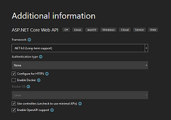

# STAG-AUIUI-P8VT-2021-2022

_Repository: [https://github.com/Tomas-Juri/STAG-AUIUI-P8VT-2021-2022_](https://github.com/Tomas-Juri/STAG-AUIUI-P8VT-2021-2022)

---

## 1. Lekce - 09.02.2022

### Prerequisites:

- [Visual Studio Community](https://visualstudio.microsoft.com/cs/downloads/) with ASP.NET and web development workload
  - This will install an IDE and .NET6 with all necessary packages


### Create Projects and run them

Create an [ASP.NET Web API](https://docs.microsoft.com/en-us/aspnet/core/tutorials/first-web-api?view=aspnetcore-6.0&tabs=visual-studio) in a new solution and

- Use the default configuration
- this will serve as your backend.

Create a [Blazor Application](https://dotnet.microsoft.com/en-us/learn/aspnet/blazor-tutorial/intro) in the same solution

- again use a default config
- this will be your frontend

Setup you visual studio to [debug both project simultaneously](https://stackoverflow.com/questions/3850019/running-two-projects-at-once-in-visual-studio).




### Connect Frontend to Backend

Add [appsettings.json](https://docs.microsoft.com/en-us/aspnet/core/blazor/fundamentals/configuration?view=aspnetcore-6.0) file to your Application.Frontend/wwwroot folder with following content.

```json
{
  "ApiUrl": "https://localhost:7015/"
}
```

Then use this ApiUrl in your HttpClient setup in Application.Frontend/Program.cs

```csharp
var apiUrl = builder.Configuration["ApiUrl"];
if (apiUrl == null)
    throw new ApplicationException("ApiUrl not defined in appsettings.json");

builder.Services.AddScoped(sp => new HttpClient { BaseAddress = new Uri(apiUrl) });
```

Add cors policy to your backend so that you don't get errors on localhost, we get back to them later in the course.

```csharp
app.UseCors(corsPolicyBuilder => corsPolicyBuilder
    .AllowAnyOrigin()
    .AllowAnyMethod()
    .AllowAnyHeader());
```

More about CORS:

- https://developer.mozilla.org/en-US/docs/Web/HTTP/CORS
- https://docs.microsoft.com/en-us/aspnet/core/security/cors?view=aspnetcore-6.0

Now we can run both apps and test if we really get the data from backend.

_Final code commit of this lecture: **37960e5d8dbdaffad510c929f1e2862e6965c008**_

---

## 2 Lekce - 16.02.2022

We will create a CI/CD pipeline to deploy our application to a staging server.

### Prerequisites:

- Pushed changes into a repository in azure devops

### Create a build definition using YAML

We will create a build definition for the backend and the frontend separately.

Frontend:

```yaml
trigger:
  branches:
    include:
      - master
  paths:
    include:
      - Application.Frontend

pool:
  vmImage: "windows-latest"

variables:
  buildConfiguration: "Release"

steps:
  - task: UseDotNet@2
    displayName: Use Dotnet 6
    inputs:
      version: "6.0.x"

  - script: dotnet clean
    displayName: "dotnet clean"

  - script: dotnet publish -o $(Build.ArtifactStagingDirectory)
    workingDirectory: Application.Frontend
    displayName: "dotnet publish"

  - task: PublishBuildArtifacts@1
    displayName: "Publish Artifact: drop"
    inputs:
      PathtoPublish: "$(Build.ArtifactStagingDirectory)"
      ArtifactName: "backend"
```

Backend:

```yml
trigger:
  branches:
    include:
      - master
  paths:
    include:
      - Application.Backend

pool:
  vmImage: "windows-latest"

variables:
  buildConfiguration: "Release"

steps:
  - task: UseDotNet@2
    displayName: Use Dotnet 6
    inputs:
      version: "6.0.x"

  - script: dotnet clean
    displayName: "dotnet clean"

  - script: dotnet publish -o $(Build.ArtifactStagingDirectory)
    workingDirectory: Application.Backend
    displayName: "dotnet publish"

  - task: PublishBuildArtifacts@1
    displayName: "Publish Artifact: drop"
    inputs:
      PathtoPublish: "$(Build.ArtifactStagingDirectory)"
      ArtifactName: "backend"
```

### Create a release pipeline in Azure DevOps

To host our applications, we will use [Azure static web app](https://azure.microsoft.com/en-.us/services/app-service/static/#overview) for frontend, and a [Azure app service](https://azure.microsoft.com/cs-cz/services/app-service/#overview) for backend.

To deploy our application, we will create two release pipelines and azure devops (backend & frontend).

Backend:


Frontend:


If we did everything correctly, we should have our application deployed and it should look like this:

- [Backend/WeatheForecast](https://stag-auiui-p8vt-2021-2022-test.azurewebsites.net/weatherforecast)
- [Frontend](https://wonderful-cliff-0c67fd803.1.azurestaticapps.net/)

### Application urls of teams

Meethub Community:

- [Backend](https://meethub-community-api.azurewebsites.net/)
- [Frontend](https://ambitious-forest-0d81ac703.1.azurestaticapps.net)

FixIt:

- [Backend](https://fixit-api.azurewebsites.net/)
- [Frontend](https://black-pebble-018be3b03.1.azurestaticapps.net)

MyBusiness:

- [Backend](https://mybusiness-api.azurewebsites.net)
- [Frontend](https://ashy-river-067e71103.1.azurestaticapps.net)

Why is swagger not running?  
Why is fetchdata page not working?

### Configure appsetting.json for our staging environment

> TODO

### Enable swagger

> TODO

### Create shared project for contracts between FE and BE

> TODO


_Final code commit of this lecture:_

---

## 3. Lekce

_Final code commit of this lecture:_

---

## 4. Lekce

_Final code commit of this lecture:_

---

## 5. Lekce

_Final code commit of this lecture:_

---

## 6. Lekce

_Final code commit of this lecture:_

---

## 7. Lekce

_Final code commit of this lecture:_

---

## 8. Lekce

_Final code commit of this lecture:_

---

## 9. Lekce

_Final code commit of this lecture:_

---

## 10. Lekce

_Final code commit of this lecture:_

---

## 11. Lekce

_Final code commit of this lecture:_

---

## 12. Lekce

_Final code commit of this lecture:_
